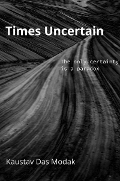

# Times Uncertain

This is the source (manuscript) for the book, [*Times Uncertain*](https://leanpub.com/times-uncertain) by [Kaustav Das Modak](https://kaustavdm.in).

## Teaser

These are stories from a lost realm of knowledge. Lost somewhere along the multiple axis of time. These may have happened. Or may be not. It is uncertain. The only certainty is a paradox. Can it be solved? Who knows.

## License

This book is licensed under [Creative Commons Attribution 4.0 International License](http://creativecommons.org/licenses/by/4.0/).

## Credits

- Cover image source: [AZ - The Wave, Paria Canyon Wilderness, Mar 1987 -BW (2)](https://www.flickr.com/photos/sloalan/10469006634/)
